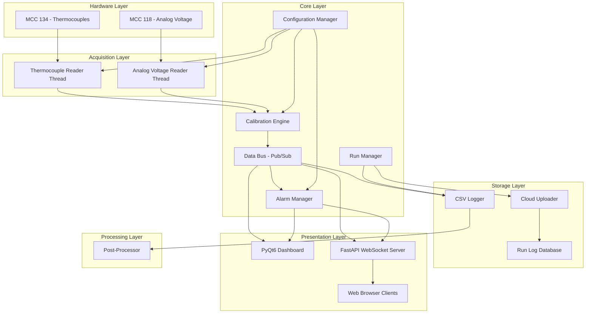

# Design Document: Rotax Dyno DAQ

## Overview

This system is a Python-based data acquisition application running on a Raspberry Pi, using Digilent MCC DAQ HATs (MCC 134 for thermocouples, MCC 118 for analog voltage) to monitor a Rotax 912 ULS engine on a dynamometer. The architecture follows a layered, event-driven design with clear separation between hardware abstraction, data processing, storage, and presentation layers.

**Key Technology Choices:**

| Layer | Technology | Rationale |
|-------|-----------|-----------|
| Language | Python 3.11+ | Native `daqhats` library support, async ecosystem, Raspberry Pi standard |
| HAT Interface | `daqhats` (PyPI) | Official MCC library with `mcc134`/`mcc118` classes |
| Desktop GUI | PyQt6 + PyQtGraph | High-performance real-time plotting, native touchscreen support, Qt ecosystem |
| Remote Monitoring | FastAPI + WebSocket | Async-native, low-latency bidirectional streaming, auto-generated API docs |
| Cloud Storage | S3-compatible (boto3) | Industry standard, works with AWS S3 or MinIO for self-hosted |
| Configuration | TOML | Human-readable, supports nested structures, Python stdlib (`tomllib`) |
| Data Format | CSV | Operator-friendly, universal tool compatibility, streaming-writable |
| Post-Processing | NumPy + SciPy | Standard scientific Python stack for filtering and signal processing |

**Design Decisions:**

1. **Async acquisition loop** — The MCC 134 reads thermocouples asynchronously (no hardware clock sync), and the MCC 118 supports polled reads. A dedicated acquisition thread per HAT avoids blocking the GUI event loop.
2. **Pub/Sub data bus** — An in-process publish-subscribe bus decouples producers (HAT readers) from consumers (GUI, logger, alarm manager, WebSocket broadcaster). This allows adding consumers without modifying acquisition code.
3. **PyQtGraph over Matplotlib** — PyQtGraph renders directly via Qt's GPU-accelerated graphics pipeline, achieving 60+ FPS for strip charts vs. Matplotlib's ~5 FPS on Raspberry Pi hardware.
4. **TOML over JSON/YAML** — TOML provides typed values (floats, integers, datetimes) natively, is human-editable, and has stdlib support in Python 3.11+.

## Architecture



**Data Flow:**

1. HAT reader threads poll hardware at configured rates
2. Raw readings pass through the Calibration Engine for unit conversion
3. Calibrated samples are published to the Data Bus with timestamps
4. Consumers (Dashboard, Logger, Alarm Manager, WebSocket) subscribe to relevant channels
5. The Alarm Manager evaluates thresholds and publishes alarm events back to the bus
6. The CSV Logger writes samples to disk; on run completion, the Cloud Uploader queues the file

## Components and Interfaces

### 1. HAT Reader (Acquisition Layer)

Dedicated threads for each HAT type, polling at configured rates.

```python
class HatReader(ABC):
    """Base class for HAT acquisition threads."""
    
    def __init__(self, address: int, channels: list[ChannelConfig], data_bus: DataBus):
        ...
    
    @abstractmethod
    def read_sample(self, channel: int) -> RawSample:
        """Read a single raw sample from the hardware."""
        ...
    
    def start(self) -> None:
        """Start the acquisition loop in a background thread."""
        ...
    
    def stop(self) -> None:
        """Stop acquisition and release hardware resources."""
        ...
    
    def set_sample_rate(self, rate_hz: float) -> None:
        """Update the sampling rate without stopping acquisition."""
        ...


class ThermocoupleReader(HatReader):
    """MCC 134 thermocouple reader using daqhats.mcc134.t_in_read()."""
    ...


class AnalogVoltageReader(HatReader):
    """MCC 118 analog voltage reader using daqhats.mcc118.a_in_read()."""
    ...
```

### 2. Calibration Engine

Converts raw voltage/temperature readings to engineering units.

```python
class CalibrationEngine:
    """Applies calibration profiles to raw sensor readings."""
    
    def apply(self, channel_id: str, raw_value: float) -> CalibratedSample:
        """Apply the channel's calibration profile to a raw value."""
        ...
    
    def update_profile(self, channel_id: str, profile: CalibrationProfile) -> None:
        """Hot-swap a calibration profile (takes effect on next sample)."""
        ...
    
    def validate_profile(self, profile: CalibrationProfile) -> ValidationResult:
        """Validate a calibration profile before applying."""
        ...


class LinearCalibration:
    """y = slope * x + offset"""
    slope: float
    offset: float
    
    def convert(self, raw: float) -> float: ...


class LookupTableCalibration:
    """Piecewise linear interpolation from voltage-to-unit pairs."""
    points: list[tuple[float, float]]  # (voltage, engineering_unit) sorted by voltage
    
    def convert(self, raw: float) -> float: ...
```

### 3. Data Bus (Pub/Sub)

In-process event bus for decoupled communication.

```python
class DataBus:
    """Thread-safe publish-subscribe bus for sensor data and events."""
    
    def publish(self, topic: str, sample: Sample) -> None:
        """Publish a sample to all subscribers of the topic."""
        ...
    
    def subscribe(self, topic: str, callback: Callable[[Sample], None]) -> SubscriptionId:
        """Subscribe to a topic with a callback."""
        ...
    
    def unsubscribe(self, subscription_id: SubscriptionId) -> None:
        """Remove a subscription."""
        ...
```

### 4. Alarm Manager

Monitors channel values against configured thresholds.

```python
class AlarmManager:
    """Evaluates channel values against thresholds and manages alarm state."""
    
    def configure_threshold(self, channel_id: str, config: AlarmConfig) -> None:
        """Set alarm thresholds for a channel."""
        ...
    
    def evaluate(self, channel_id: str, value: float) -> AlarmState:
        """Evaluate a value against configured thresholds, applying deadband."""
        ...
    
    def acknowledge(self, alarm_id: str) -> None:
        """Acknowledge an active alarm (silences audible, keeps visual)."""
        ...
    
    def get_active_alarms(self) -> list[ActiveAlarm]:
        """Return all currently active alarm conditions."""
        ...
```

### 5. CSV Logger

Writes timestamped sensor data to CSV files.

```python
class CsvLogger:
    """Manages CSV file creation, writing, and flushing during runs."""
    
    def start_run(self, run_info: RunInfo) -> None:
        """Create a new CSV file and write the header."""
        ...
    
    def write_sample(self, sample: CalibratedSample) -> None:
        """Buffer a sample for writing."""
        ...
    
    def flush(self) -> None:
        """Flush buffered data to disk (called at least once per second)."""
        ...
    
    def stop_run(self) -> RunSummary:
        """Close the CSV file and append summary metadata."""
        ...
```

### 6. Cloud Uploader

Manages file upload queue with retry logic.

```python
class CloudUploader:
    """Queues and uploads CSV files to cloud storage with retry."""
    
    def queue_upload(self, file_path: Path) -> None:
        """Add a file to the upload queue."""
        ...
    
    def get_status(self, file_path: Path) -> UploadStatus:
        """Get the upload status of a queued file."""
        ...
    
    def cancel(self, file_path: Path) -> None:
        """Cancel a pending or in-progress upload."""
        ...
```

### 7. Run Manager

Orchestrates run lifecycle and metadata.

```python
class RunManager:
    """Manages run lifecycle, metadata, and the run log."""
    
    def start_run(self, name: str, notes: str = "") -> Run:
        """Start a new recording run."""
        ...
    
    def stop_run(self) -> RunSummary:
        """Stop the active run and finalize."""
        ...
    
    def get_run_log(self, filters: RunFilters | None = None) -> list[RunSummary]:
        """Query the run log with optional filters."""
        ...
    
    def tag_run(self, run_id: str, tags: list[str]) -> None:
        """Add tags to a completed run."""
        ...
    
    def export_run(self, run_id: str, output_path: Path) -> None:
        """Export a run as a standardized CSV."""
        ...
```

### 8. Post-Processor

Applies filtering and derives calculated channels.

```python
class PostProcessor:
    """Applies signal processing to recorded data."""
    
    def low_pass_filter(self, data: np.ndarray, cutoff_hz: float, sample_rate_hz: float) -> np.ndarray:
        """Apply a Butterworth low-pass filter."""
        ...
    
    def moving_average(self, data: np.ndarray, window_size: int) -> np.ndarray:
        """Apply a moving average smoothing filter."""
        ...
    
    def calculate_spread(self, channels: dict[str, np.ndarray]) -> np.ndarray:
        """Calculate EGT spread (max - min across channels per timestamp)."""
        ...
    
    def calculate_rate_of_change(self, data: np.ndarray, sample_interval_s: float) -> np.ndarray:
        """Calculate rate of change (derivative) of a channel."""
        ...
    
    def process_and_save(self, source_path: Path, config: PostProcessConfig) -> Path:
        """Apply processing pipeline and save to new CSV file."""
        ...
```

### 9. Dashboard (PyQt6)

Touchscreen-friendly GUI with engine overlay and strip charts.

```python
class DashboardWindow(QMainWindow):
    """Main application window with tabbed views."""
    
    def __init__(self, data_bus: DataBus, alarm_manager: AlarmManager, ...):
        ...


class EngineOverlayWidget(QWidget):
    """Renders sensor values at physical locations on engine diagram."""
    ...


class StripChartWidget(pg.PlotWidget):
    """Real-time scrolling time-series chart for a channel."""
    ...


class AlarmIndicatorWidget(QWidget):
    """Visual and audible alarm display with acknowledge button."""
    ...
```

### 10. WebSocket Server (FastAPI)

Serves real-time data to remote browser clients.

```python
# FastAPI application for remote monitoring
app = FastAPI()

@app.websocket("/ws/live")
async def live_data_stream(websocket: WebSocket):
    """Stream live channel data to connected clients."""
    ...

@app.get("/api/runs")
async def list_runs(page: int = 1, page_size: int = 50, ...):
    """Paginated run listing with filters."""
    ...

@app.get("/api/runs/{run_id}/data")
async def get_run_data(run_id: str):
    """Retrieve historical run data for charting."""
    ...
```

### 11. Configuration Manager

Persists and loads system configuration.

```python
class ConfigurationManager:
    """Manages system configuration persistence and validation."""
    
    def load(self) -> SystemConfig:
        """Load configuration from TOML file, or return defaults."""
        ...
    
    def save(self) -> None:
        """Persist current configuration to TOML file."""
        ...
    
    def export_config(self, path: Path) -> None:
        """Export configuration to a specified file."""
        ...
    
    def import_config(self, path: Path) -> ValidationResult:
        """Validate and import configuration from a file."""
        ...
    
    def get(self, key: str) -> Any:
        """Get a configuration value by dotted key path."""
        ...
    
    def set(self, key: str, value: Any) -> None:
        """Set a configuration value and schedule persistence."""
        ...
```

## Data Models

```python
from dataclasses import dataclass, field
from datetime import datetime
from enum import Enum
from pathlib import Path
from typing import Optional


# --- Enumerations ---

class ChannelType(Enum):
    THERMOCOUPLE = "thermocouple"
    PRESSURE = "pressure"
    RPM = "rpm"
    AFR = "afr"


class CalibrationType(Enum):
    LINEAR = "linear"
    LOOKUP_TABLE = "lookup_table"


class AlarmSeverity(Enum):
    NORMAL = "normal"
    WARNING = "warning"
    CRITICAL = "critical"


class AlarmState(Enum):
    INACTIVE = "inactive"
    ACTIVE = "active"
    ACKNOWLEDGED = "acknowledged"


class UploadStatus(Enum):
    PENDING = "pending"
    IN_PROGRESS = "in_progress"
    COMPLETED = "completed"
    FAILED = "failed"


class SampleValidity(Enum):
    VALID = "valid"
    INVALID = "invalid"
    OUT_OF_RANGE = "out_of_range"
    STALE = "stale"
    UNCALIBRATED = "uncalibrated"


# --- Core Data Models ---

@dataclass
class RawSample:
    channel_id: str
    timestamp_ms: float  # milliseconds since run start (or epoch if no run)
    raw_value: float
    validity: SampleValidity = SampleValidity.VALID


@dataclass
class CalibratedSample:
    channel_id: str
    timestamp_ms: float
    raw_value: float
    calibrated_value: float
    unit: str
    validity: SampleValidity = SampleValidity.VALID


# --- Configuration Models ---

@dataclass
class LinearCalibrationParams:
    slope: float
    offset: float


@dataclass
class LookupTableParams:
    points: list[tuple[float, float]]  # (voltage, engineering_unit) pairs, 2-64 entries


@dataclass
class CalibrationProfile:
    calibration_type: CalibrationType
    unit_label: str
    min_valid_voltage: float
    max_valid_voltage: float
    linear_params: Optional[LinearCalibrationParams] = None
    lookup_params: Optional[LookupTableParams] = None


@dataclass
class ChannelConfig:
    channel_id: str
    channel_type: ChannelType
    hat_address: int
    hat_channel: int
    sample_rate_hz: float
    calibration: CalibrationProfile
    display_name: str = ""
    enabled: bool = True


@dataclass
class AlarmThreshold:
    low_warning: Optional[float] = None
    low_critical: Optional[float] = None
    high_warning: Optional[float] = None
    high_critical: Optional[float] = None
    deadband: float = 0.0


@dataclass
class AlarmConfig:
    channel_id: str
    thresholds: AlarmThreshold
    enabled: bool = True


@dataclass
class ActiveAlarm:
    alarm_id: str
    channel_id: str
    severity: AlarmSeverity
    triggered_at: datetime
    value: float
    threshold_crossed: float
    state: AlarmState = AlarmState.ACTIVE


# --- Run Models ---

@dataclass
class RunInfo:
    name: str  # 1-100 characters
    notes: str = ""  # up to 1000 characters
    tags: list[str] = field(default_factory=list)  # up to 10 tags, each up to 50 chars
    operator: str = ""


@dataclass
class RunSummary:
    run_id: str
    name: str
    start_time: datetime
    end_time: datetime
    duration_seconds: float
    sample_counts: dict[str, int]  # channel_id -> count
    min_values: dict[str, float]  # channel_id -> min
    max_values: dict[str, float]  # channel_id -> max
    mean_values: dict[str, float]  # channel_id -> mean
    notes: str = ""
    tags: list[str] = field(default_factory=list)
    csv_path: Optional[Path] = None
    upload_status: UploadStatus = UploadStatus.PENDING


# --- Cloud Models ---

@dataclass
class CloudConfig:
    endpoint_url: str
    bucket_name: str
    access_key: str
    secret_key: str
    destination_prefix: str = ""
    upload_timeout_seconds: int = 300
    max_retries: int = 10
    retry_interval_seconds: int = 60
    max_queue_size: int = 100


@dataclass
class UploadTask:
    file_path: Path
    run_id: str
    status: UploadStatus = UploadStatus.PENDING
    attempts: int = 0
    last_attempt: Optional[datetime] = None
    error_message: str = ""


# --- Post-Processing Models ---

@dataclass
class PostProcessConfig:
    source_path: Path
    channels_to_process: list[str]
    low_pass_cutoff_hz: Optional[float] = None  # 0.1 to Nyquist
    moving_average_window: Optional[int] = None  # 3 to 101, odd
    calculate_egt_spread: bool = False
    calculate_rate_of_change: list[str] = field(default_factory=list)


# --- System Configuration ---

@dataclass
class SystemConfig:
    channels: list[ChannelConfig] = field(default_factory=list)
    alarms: list[AlarmConfig] = field(default_factory=list)
    cloud: Optional[CloudConfig] = None
    csv_directory: Path = Path("/home/pi/dyno_data")
    fallback_csv_directory: Optional[Path] = None
    web_server_port: int = 8080
    max_remote_connections: int = 3
    dashboard_time_window_seconds: int = 60
    disk_space_warning_mb: int = 50
```

## Correctness Properties

*A property is a characteristic or behavior that should hold true across all valid executions of a system — essentially, a formal statement about what the system should do. Properties serve as the bridge between human-readable specifications and machine-verifiable correctness guarantees.*

### Property 1: Sample rate clamping and defaults

*For any* channel type (thermocouple, pressure, RPM, AFR) and *for any* numeric rate value, the system SHALL clamp the effective sample rate to the channel type's valid range ([1,10] Hz for thermocouple, [10,100] Hz for pressure/RPM, [10,50] Hz for AFR) and SHALL apply the correct default rate (5, 10, 50, 20 Hz respectively) when no rate is explicitly configured.

**Validates: Requirements 1.3, 2.3, 3.3, 4.3**

### Property 2: Out-of-range voltage produces invalid sample

*For any* channel with a configured Calibration_Profile and *for any* raw voltage reading that falls outside the profile's [min_valid_voltage, max_valid_voltage] range, the system SHALL mark the resulting sample with INVALID validity.

**Validates: Requirements 2.4, 3.5, 4.4**

### Property 3: Open-circuit fault produces invalid sample

*For any* thermocouple channel that reports an open-circuit fault condition, the system SHALL mark the resulting sample with INVALID validity.

**Validates: Requirements 1.4**

### Property 4: Linear calibration correctness

*For any* channel with a linear Calibration_Profile (slope, offset) and *for any* raw voltage within the valid range, the calibrated output SHALL equal `slope * voltage + offset`.

**Validates: Requirements 2.2, 3.2, 4.2, 11.2**

### Property 5: Lookup table interpolation correctness

*For any* valid lookup table (2–64 sorted voltage-to-unit pairs with no duplicate voltages) and *for any* voltage between the table's minimum and maximum voltage entries, the calibrated output SHALL equal the linear interpolation between the two nearest bracketing points.

**Validates: Requirements 2.2, 4.2, 11.3**

### Property 6: Lookup table out-of-range clamping

*For any* valid lookup table and *for any* voltage outside the table's [min_voltage, max_voltage] range, the output SHALL be clamped to the nearest boundary value and the sample SHALL be flagged as OUT_OF_RANGE.

**Validates: Requirements 11.6**

### Property 7: RPM below-minimum yields zero

*For any* RPM channel and *for any* voltage below the Calibration_Profile's minimum valid threshold, the system SHALL report RPM as zero (not invalid, but zero).

**Validates: Requirements 3.4**

### Property 8: RPM output clamping

*For any* RPM channel and *for any* valid voltage input, the calibrated RPM output SHALL be constrained to the range [0, 9000].

**Validates: Requirements 3.2**

### Property 9: Stale data detection

*For any* channel and *for any* time interval exceeding 3 seconds since the last sample update, the system SHALL mark that channel's display state as stale.

**Validates: Requirements 5.6**

### Property 10: CSV filename and header generation

*For any* valid run name (1–100 characters) and *for any* start timestamp, the generated CSV filename SHALL match the pattern `YYYYMMDD_HHMMSS_{run_name}.csv` and the header SHALL contain the run name, start time, channel list, and sampling rates.

**Validates: Requirements 6.1**

### Property 11: CSV sample serialization round-trip

*For any* CalibratedSample, writing it to CSV and then parsing the CSV row back SHALL produce an equivalent sample (channel_id, timestamp_ms, calibrated_value, unit, validity).

**Validates: Requirements 6.2**

### Property 12: Run summary correctness

*For any* non-empty sequence of CalibratedSamples for a run, the computed RunSummary SHALL have: duration equal to (last_timestamp - first_timestamp), sample_count equal to the number of valid samples per channel, min/max equal to the actual minimum/maximum calibrated values per channel.

**Validates: Requirements 6.4**

### Property 13: Upload state machine validity

*For any* upload task, the status SHALL only transition through valid states: PENDING → IN_PROGRESS → COMPLETED, or PENDING → IN_PROGRESS → FAILED (after max retries or timeout). The attempt count SHALL never exceed the configured maximum (10), and a task at FAILED or COMPLETED SHALL not transition to any other state.

**Validates: Requirements 7.2, 7.3, 7.4**

### Property 14: Upload queue capacity enforcement

*For any* upload queue state, the queue SHALL accept new files when the queue size is below 100, and SHALL reject new additions (without discarding existing files) when the queue size equals 100.

**Validates: Requirements 7.5**

### Property 15: Remote connection limiting

*For any* state where the number of active WebSocket connections equals the configured maximum (3), a new connection attempt SHALL be rejected. For any state where connections are below the maximum, a new connection SHALL be accepted.

**Validates: Requirements 8.4, 8.5**

### Property 16: Alarm threshold crossing detection

*For any* channel with configured alarm thresholds and *for any* value that crosses above a high threshold or below a low threshold, the Alarm_Manager SHALL transition the alarm state to ACTIVE with the correct severity level (warning or critical based on which threshold was crossed).

**Validates: Requirements 10.2, 10.3**

### Property 17: Alarm deadband clearing

*For any* active alarm and *for any* channel value that returns within the configured threshold by at least the deadband amount, the Alarm_Manager SHALL clear the alarm (transition to INACTIVE). For values that return within the threshold but have not crossed the deadband, the alarm SHALL remain ACTIVE.

**Validates: Requirements 10.6**

### Property 18: Alarm acknowledgment state

*For any* active alarm, acknowledging it SHALL transition the state to ACKNOWLEDGED (audible silenced, visual maintained). The alarm SHALL only clear when the underlying value satisfies the deadband condition.

**Validates: Requirements 10.7**

### Property 19: Calibration profile validation

*For any* Calibration_Profile with fewer than 2 lookup table points, or with duplicate voltage entries in the lookup table, validation SHALL reject the profile. For any profile with 2–64 unique, sorted voltage entries, validation SHALL accept it.

**Validates: Requirements 11.7**

### Property 20: Configuration serialization round-trip

*For any* valid SystemConfig, serializing to TOML and then deserializing SHALL produce an equivalent configuration object. Similarly, exporting and then importing a configuration SHALL produce an equivalent result.

**Validates: Requirements 11.5, 14.2, 14.3**

### Property 21: Low-pass filter frequency attenuation

*For any* signal containing a known frequency component above the configured cutoff frequency, and *for any* valid cutoff (0.1 Hz to Nyquist), the low-pass filter output SHALL attenuate that frequency component (output amplitude < input amplitude at that frequency).

**Validates: Requirements 12.1**

### Property 22: Moving average correctness

*For any* data array of length N and *for any* valid window size W (3 ≤ W ≤ 101, W ≤ N), each output sample at index i SHALL equal the arithmetic mean of the input samples in the window centered at i (with appropriate boundary handling).

**Validates: Requirements 12.2**

### Property 23: Derived channel correctness (EGT spread and rate of change)

*For any* set of EGT channel values at a given timestamp, the EGT spread SHALL equal max(values) - min(values). *For any* two consecutive samples with values v1, v2 and time interval dt, the rate of change SHALL equal (v2 - v1) / dt.

**Validates: Requirements 12.3**

### Property 24: Post-processing preserves original file

*For any* source CSV file, after post-processing produces a new output file, the original source file SHALL remain byte-for-byte identical to its state before processing.

**Validates: Requirements 12.4**

### Property 25: Post-processing parameter validation

*For any* cutoff frequency above half the channel's sampling rate, or *for any* moving average window size outside [3, 101], the Post_Processor SHALL reject the parameter with an error message indicating the valid range.

**Validates: Requirements 12.6**

### Property 26: Invalid sample exclusion in filtering

*For any* data array containing samples marked as invalid, the filter (low-pass or moving average) SHALL exclude those samples from its computation window and SHALL mark the corresponding output positions as invalid.

**Validates: Requirements 12.7**

### Property 27: Run metadata validation

*For any* run name of length 0 or length > 100, the system SHALL reject it. *For any* run name that duplicates an existing run name, the system SHALL reject it. *For any* set of tags where count > 10 or any tag length > 50 characters, the system SHALL reject the tags.

**Validates: Requirements 13.1, 13.2, 13.4**

### Property 28: Run log filtering correctness

*For any* run log and *for any* filter criteria (name substring, date range, tag set), the filtered results SHALL contain exactly those runs that match ALL specified criteria simultaneously, sorted by date descending.

**Validates: Requirements 13.5, 9.4**

### Property 29: Run pagination correctness

*For any* list of N runs, paginating with page size 50 SHALL produce ceil(N/50) pages, each containing at most 50 runs, with all runs appearing exactly once across all pages, sorted by date descending.

**Validates: Requirements 9.1**

### Property 30: Configuration import validation

*For any* configuration file containing values outside their valid ranges (e.g., sample rates outside allowed bounds, negative deadband values), import SHALL reject the file and the current system configuration SHALL remain unchanged.

**Validates: Requirements 14.5**

## Error Handling

### Hardware Errors

| Error Condition | Detection | Response |
|----------------|-----------|----------|
| Thermocouple open-circuit | MCC 134 returns `TC_OPEN` status | Mark sample INVALID, show fault indicator on Dashboard |
| HAT not found at address | `hat_list()` returns empty or wrong ID | Log error, disable affected channels, notify operator |
| HAT communication failure | `HatError` exception from daqhats | Retry 3 times with 100ms delay, then mark channel as faulted |
| Voltage out of calibration range | Value outside `[min_valid_voltage, max_valid_voltage]` | Mark sample INVALID or OUT_OF_RANGE, show fault indicator |

### Storage Errors

| Error Condition | Detection | Response |
|----------------|-----------|----------|
| Disk space < 50 MB | `shutil.disk_usage()` check every 10 seconds | Alert operator, continue logging until exhausted |
| CSV write failure | `IOError` / `OSError` on write | Alert operator, switch to fallback directory |
| Fallback directory also fails | `IOError` on fallback write | Alert operator, buffer in memory (limited), stop run if memory exhausted |
| Config save failure | `IOError` on TOML write | Notify operator, retry on next config change |

### Network Errors

| Error Condition | Detection | Response |
|----------------|-----------|----------|
| Cloud upload network failure | `boto3` connection/timeout exception | Queue file, retry at 60s intervals, max 10 attempts |
| Upload timeout (300s) | `asyncio.timeout` or threading timer | Cancel upload, count as failed attempt |
| All retries exhausted | Attempt counter reaches 10 | Mark as FAILED, notify operator via Dashboard |
| WebSocket client disconnect | Connection closed/error event | Remove from active connections, free slot |
| Max WebSocket connections | Connection count >= 3 | Reject new connection with capacity message |

### Configuration Errors

| Error Condition | Detection | Response |
|----------------|-----------|----------|
| Config file missing/corrupted | `FileNotFoundError` or `tomllib.TOMLDecodeError` | Load factory defaults, show persistent notification |
| Invalid import file | Validation against schema/ranges | Reject import, retain current config, show error details |
| Invalid calibration profile | < 2 points or duplicate voltages | Reject save, show validation error message |

### Graceful Degradation Strategy

The system prioritizes continued operation over strict correctness:
1. **Individual channel faults** do not stop other channels from acquiring
2. **Cloud upload failures** do not affect local data logging
3. **Remote monitoring failures** do not affect local Dashboard operation
4. **Configuration persistence failures** do not stop the running system

## Testing Strategy

### Property-Based Testing

**Library:** [Hypothesis](https://hypothesis.readthedocs.io/) (Python's standard PBT library)

**Configuration:**
- Minimum 100 examples per property test
- Deadline: 1000ms per example (generous for Raspberry Pi)
- Database: store failing examples for regression

**Property tests cover:**
- Calibration engine (Properties 4, 5, 6, 7, 8)
- Alarm manager logic (Properties 16, 17, 18)
- CSV serialization (Properties 10, 11, 12)
- Upload state machine (Properties 13, 14)
- Post-processing math (Properties 21, 22, 23, 25, 26)
- Configuration round-trip (Property 20)
- Input validation (Properties 1, 2, 3, 9, 19, 27, 28, 29, 30)
- Connection limiting (Property 15)
- File preservation (Property 24)

Each property test SHALL be tagged with:
```python
# Feature: rotax-dyno-daq, Property {N}: {property_text}
```

### Unit Tests (Example-Based)

- Calibration profile CRUD operations
- Run start/stop lifecycle with specific scenarios
- Dashboard widget rendering (snapshot tests)
- Alarm configuration UI interactions
- Factory default values verification
- Error message content verification

### Integration Tests

- MCC 134/118 hardware communication (requires physical HATs)
- CSV flush timing verification (< 1 second)
- WebSocket latency measurement (< 2 seconds)
- Cloud upload end-to-end with MinIO test container
- Configuration hot-reload timing (< 1 second)
- Dashboard refresh rate measurement (≥ 10 Hz)

### Smoke Tests

- HAT discovery and initialization
- Web server startup on configured port
- File system write permissions
- Network interface availability

### Test Infrastructure

```
tests/
├── property/           # Hypothesis property-based tests
│   ├── test_calibration.py
│   ├── test_alarm_manager.py
│   ├── test_csv_logger.py
│   ├── test_cloud_uploader.py
│   ├── test_post_processor.py
│   ├── test_config_manager.py
│   ├── test_run_manager.py
│   └── test_connection_limiter.py
├── unit/               # Example-based unit tests
│   ├── test_channel_config.py
│   ├── test_dashboard_widgets.py
│   └── test_run_lifecycle.py
├── integration/        # Integration tests (may require hardware)
│   ├── test_hat_communication.py
│   ├── test_csv_timing.py
│   ├── test_websocket_latency.py
│   └── test_cloud_upload.py
└── conftest.py         # Shared fixtures and Hypothesis profiles
```

